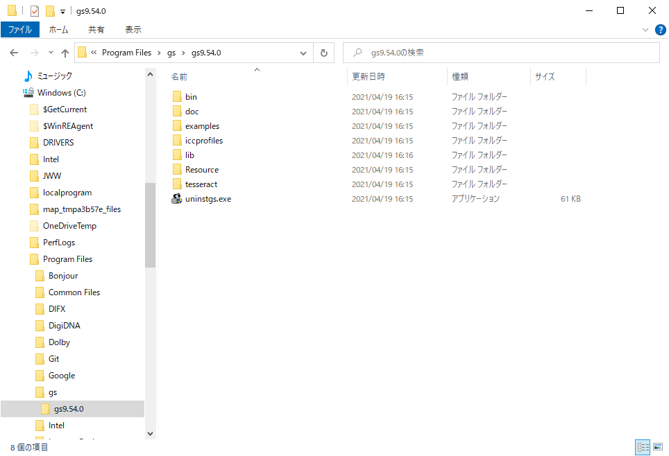
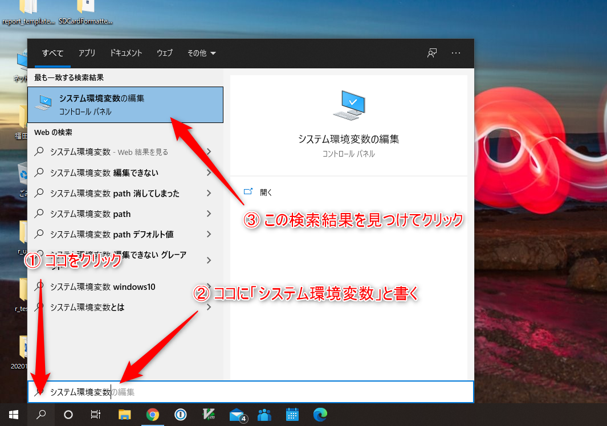
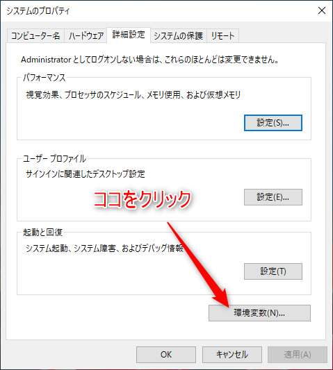
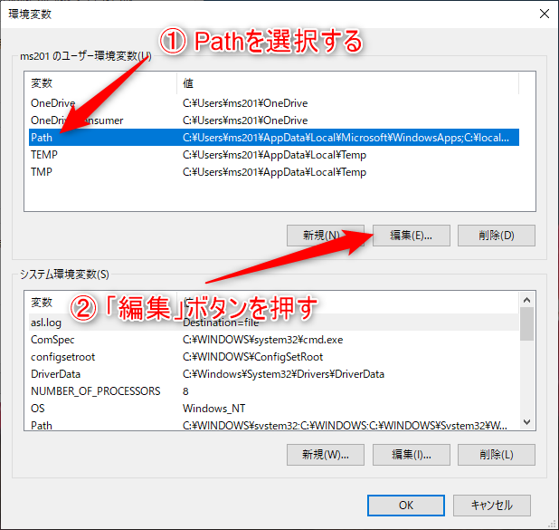
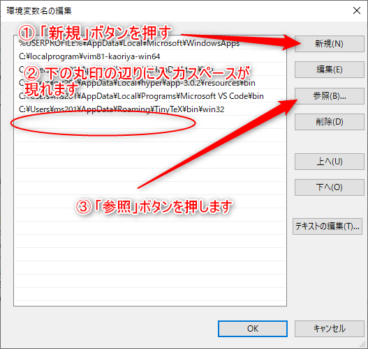
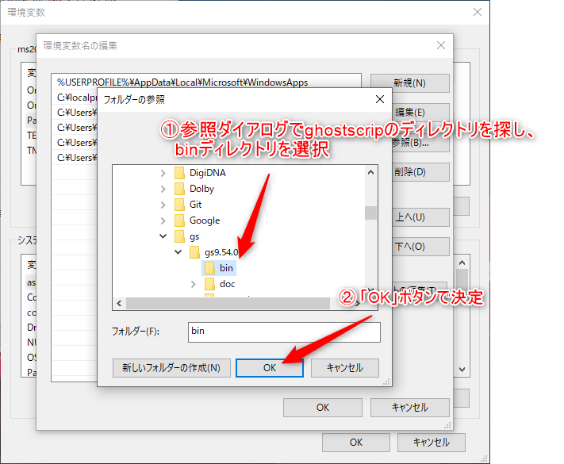
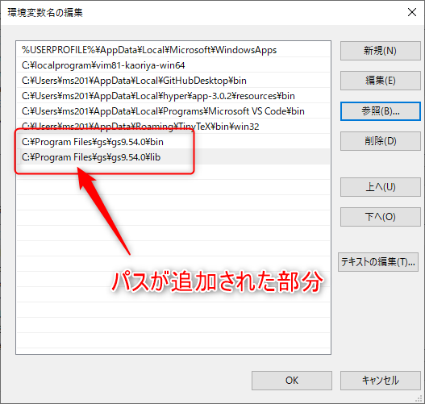

# ghostscriptを設定する

[ghostscript](https://www.ghostscript.com/)は、
pdfを扱うのに必要となるプログラムで、
texシステムから呼ばれて使われます。

そこで、ここでの作業は、
まず、`ghostscript`をインストールし、
次に、インストールされた`ghostscript`を、
他のプログラム（TeX等）から利用できるようにする設定を行います。

## インストール

ghostscriptのサイトにある、ダウンロードページからwindows用のインストールファイルをダウンロードします。

https://www.ghostscript.com/download/gsdnld.html

ページの表にある「Ghostscript X.XX.X for Windows (64 bit)」項目の右側の
どちらか相応しい方のライセンスを選んで、
ダウンロードしてください。

インストールファイルがダウンロード出来たら、
そのファイルをダブルクリックしてインストーラーを起動、
デフォルトでインストールして下さい。

## 他のプログラムから利用する設定

ghostscriptを他のプログラムから利用するため、
Windowsの環境変数pathに、今インストールした、ghostscriptの中にある、
binディレクトリとlibディレクトリを追加する設定を行います。

まず、ghostscriptがインストールされている場所を確認します。
デフォルトでインストールするとCドライブの中の`Program Files`ディレクトリに`gs`というディレクトリが作られ、
その中にバージョン付きのディレクトリが作成されてインストールされています。


```{r gs000, echo=FALSE, out.width="80%", fig.cap="gsのインストール先"}

```


ウィンドウズのファイルエクスプローラー等を利用して、
その場所を確認してください。

`C:\Program Files\gs\gs.9.54.0`というパスの中に`bin`というディレクトリと
`lib`というディレクトリがあることを確認します。


### システムのプロパティダイアログを検索して開く

環境変数は、windowsの「システムのプロパティダイアログ」から行います。

ウィンドウズのデスクトップ左下のウィンドウズマーク（メニューを開くところ）
の隣に、虫眼鏡のマークがあるのでそこをクリックします。
あらわれた検索用のメニューの「ここに入力して検索」と書かれている部分に「システム環境変数」と入力します。

そうすると、検索結果に「システム環境変数の編集コントロールパネル」と表示されるのでそこをクリックしてください。

```{r gs001, echo=FALSE, out.width="80%", fig.cap="検索窓"}

```


### システムのプロパティダイアログ

システムのプロパティダイアログが開かれます。
そのダイアログの下の方にある「環境変数」ボタンをクリックします。

```{r gs002, echo=FALSE, out.width="80%", fig.cap="システムのプロパティ"}

```


### 環境変数ダイアログ

環境変数ダイアログが開かれます。
これを使って、環境変数Pathの設定を行います。

まず、上側にあるユーザー環境変数の一覧の「Path」の行をクリックすると、
色がついて選択された状態になります。
選択したら、すぐ下の「編集」ボタンをクリックします。

```{r gs003, echo=FALSE, out.width="80%", fig.cap="環境変数ダイアログ"}

```


### 環境変数名の編集ダイアログ {#hensuumei}

環境変数名の編集というダイアログが開いて、登録されているパスの一覧が表示されます。

環境変数Pathの編集を行うとき、既に登録されているPathを消してしまうと、
Windowsがコマンドをうまく探せなくなる不具合が発生します。
間違って編集してしまっても元に戻せるように、
パスの一覧等をスクリーンショットやスマホの写真等で撮っておきましょう。
また、各内容を編集した後OKボタンを押さなければ、反映されないので、
不安になったら、「キャンセル」ボタンを押して、最初からやり直せばOKです。
逆に、編集後は、必ず「OK」ボタンを押し忘れないようにしましょう。
編集内容が反映されません。


ここに、先に見た、ghostscriptのインストールされたディレクトリ内にある、binディレクトリと、libディレクトリを登録します。

まずは、右側の「新規」ボタンを押すと、行の一番下が入力可能になります。
その状態で、右側の「参照」ボタンを押します。


```{r gs004, echo=FALSE, out.width="80%", fig.cap="環境変数名の編集ダイアログ"}

```


### フォルダの参照ダイアログでbinディレクトリを探す

フォルダの参照ダイアログが現れるので、
これを使って、ghostscriptがインストールされたディレクトリ内の
`bin`ディレクトリを探します。
「PC」の中の「Windws(C:)」から辿ってみましょう。

みつけたら、そのbinディレクトりをクリックして選択します。

選択したら、下にある「OK」ボタンをクリックします。


```{r gs005, echo=FALSE, out.width="80%", fig.cap="フォルダの参照"}

```


binディレクトリをPathに登録できたら、
もう一度、chapter \@ref(hensuumei) から初めて、libディレクトリを同様に登録します。

最終的に次のようになります。

```{r gs006, echo=FALSE, out.width="80%", fig.cap="gsのPathへの登録完了"}

```

