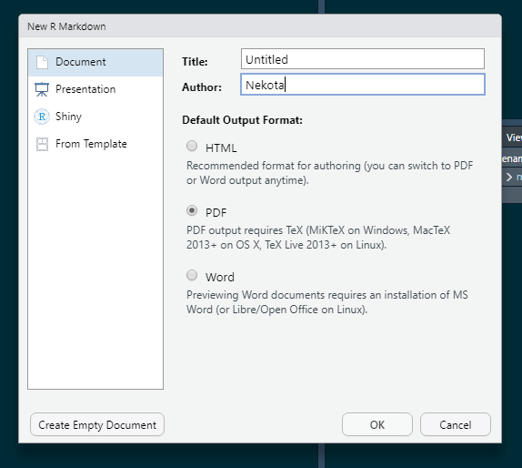
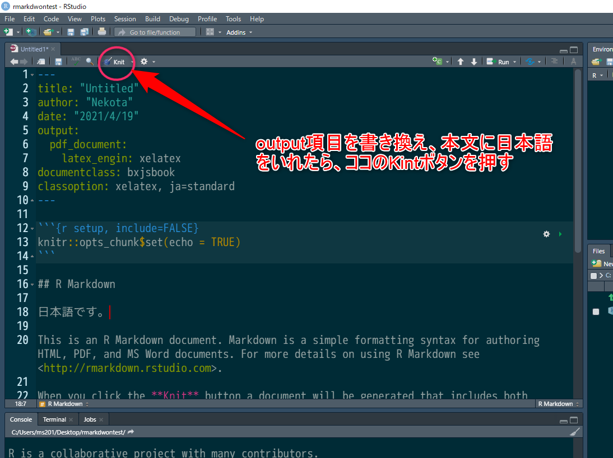

# TeXパッケージのインストール

TeXもRと同様に、沢山のパッケージとともに利用されます。
ここでは、rmarkdownを利用したpdf出力で
必須のパッケージをインストールします。


## TeXパッケージをコマンドでインストール

RStudio等を開いて、Rのコンソールを開いて下さい。

次のコマンドをRのプロンプトから実行します。

### pdfcropパッケージのインストール

```{r eval=FALSE}
tinytex::tlmgr_install("pdfcrop")
```

`tlmgr_install()`コマンドはTeXのパッケージをCTANと呼ばれる公開先からインストールしてくれるRのコマンドです。
インストールしたいTeXのパッケージを引数として渡します。
ここでは、TeXのpdfcropパッケージをインストールするので、
`"pdfcrop"`を引数として渡しています。

### ipaexのインストール

次は、TeXで利用される日本語フォントパッケージのインストールです。

次のコマンドをRのプロンプトに渡して実行しましょう。

```{r eval=FALSE}
tinytex::tlmgr_install("ipaex")
```


## rmarkdownファイルをKnitする

上記以外のTeXパッケージは、
tinytex自体が必要に応じて大体自動的にインストールしてくれます。

今から実際にpdfの作成を行いますが、
pdfの作成には関連する一時ファイルが沢山作成されて、
作業場所が散らかるので、
空のディレクトリを用意し、そこにRStudioでプロジェクトを作って下さい。

準備が出来たら、その新しいプロジェクトを開き、
RStudioのメニューから「File」＞「New File」＞「R Markdown」を選択して下さい。

ダイアログが現れるので、次のようにpdfを選びます。

```{r tex000, echo=FALSE, out.width="80%", fig.cap="New R Markdown File"}

```

新しいファイルが編集領域に現れたら、
そのファイルのはじめの`---`で囲まれた部分のうち、
`output:`の行以下を次のように書き換えます。

それ以外の`title:`や`author`の行は、そのままでOKです。


```{yaml eval=FALSE}
---
title: "Untitled"
author: "Nekota"
output: 
  pdf_document:
    latex_engine: xelatex
documentclass: bxjsbook
classoption: xelatex, ja=standard
---
```

次に、もう少し下の方にある本文の中の`## R Markdown`と書かれた行の次の行に、
「日本語です」と、日本語を書き込みます。

作業が終わったら、編集領域の上にある「Knit」ボタンを押します。

```{r tex001, echo=FALSE, out.width="100%", fig.cap="RStudio"}

```

「Knit」ボタンを押すと、rmarkdown ファイルの中の、
Rコードが処理され、その出力結果がそれ以外の部分と統合されて
単なるmarkdownファイルとなり、
そのmarkdownファイルが、ここではTeXの処理でpdfファイルに変換されます。

このTeXの処理が開始されると、
システムにないTeXのパッケージをtinytexが自動的に
インストールしてくれます。
ここでは、幾つかのパッケージがインストールされるので、
コンソールにプロンプトが戻るまで、しばらく時間が掛かります。

全ての処理が終わると、プロジェクト内にpdfファイルが出来ているはずです。


## repocoを使う

RStudio付属のrmarkdownのテンプレートを処理することで、
幾つかのTeXパッケージが自動的にインストールされました。
ここまでの準備が整うと、
repocoパッケージの関数を呼び出すことが出来るようになります。

ですから、次は実際にrepocoパッケージの関数で実際にレポートを作成します。

しかし、このとき、更に、必要なTeXパッケージが自動的に読み込まれます。

### retiでデータを読み込む

retiパッケージを使って、
[国土交通省が公表する不動産取引価格情報](https://www.land.mlit.go.jp/webland/download.html)の
csvファイルからデータを読み込みます。
retiについては、以下を参考にして下さい。

[Welcome to the reti wiki!](https://github.com/rea-osaka/reti/wiki)

大阪府に関する不動産取引価格情報のcsvファイルを`osaka.csv`として保存したとして、
枚方市に関する土地と建物の一体取引のうち、
2017年以降のデータを取り出すRのコードを例示すれば以下のようになります。

```{r eval=FALSE}
library(tidyverse)
library(reti)

hirakata <- 
  reti_read_LB("osaka.csv") %>% 
  reti_filter_by_city("枚方市") %>% 
  filter(t_year >= 2017)
```

この`hirakata`データをrepocoパッケケージの`newhouse_quarter_report()`関数に渡す事で、pdf形式のレポートを出力してくれます。


```{r eval=FALSE}
library(repoco)

newhouse_quarter_report(hirakata)
```

関数が実行されると自動的に処理が行われます。
しばらくすると、内部で自動的にTeXパッケージが読み込まれている様子が
表示されます。
かなりの数のパッケージがインストールされるので、
少し時間がかかりますが、ゆっくり待ちましょう。

プロンプトが戻ると、カレントディレクトリに`new_house_quarter_report.pdf`というファイルが作成されているはずです。

### 最後に

以上の作業を終えると、rmarkdownでpdfの出力が出来るようになっています。

また、TeXのパッケージのインストールは、一回だけです。
次回からのレポート処理は、インストール作業はないので、
その時間はかからなくなります。

但し、TeXの処理は膨大な計算を行うので、
大きな文書を処理する場合、少し時間が掛かります。
その分、綺麗に文書を作ってくれるので、イライラせずに使いましょう。


